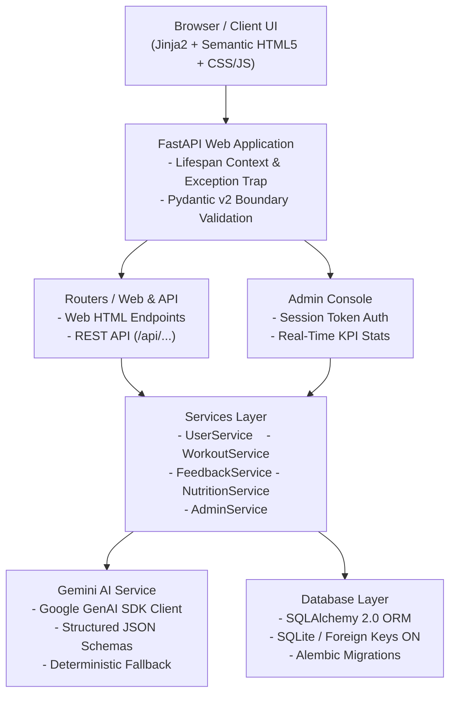

# FitBuddy
An AI fitness plan generator using Gemini models.

## Key Features
1. **Personalized User Profiling Engine** — Collects critical user parameters including age, body weight, primary fitness objectives (*Weight Loss*, *Muscle Building*, *General Health*), preferred intensity levels, and overall athletic background.
2. **AI-Powered 7-Day Routine Generator** — Utilizes Gemini AI to design full weekly training cycles complete with daily target focus areas, warm-up routines, detailed exercise prescriptions (sets, reps, rest periods, technique cues), cool-downs, and recovery protocols.
3. **Conversational Plan Customization** — Enables users to modify their active routines using natural language inputs (e.g., *"Add more cardio"*, *"Insert an extra rest day"*), automatically creating versioned revisions while preserving historic baselines.
4. **Tailored Nutrition & Recovery Advisor** — Delivers target-aligned dietary advice, hydration baselines, protein intake timing, and actionable sleep hygiene practices.
5. **Hardened Administrative Dashboard** — Provides a secure management interface powered by PBKDF2-HMAC-SHA256 password encryption, HMAC-SHA256 signed session tokens, live analytics, user inspection, and cascading account deletion tools.
6. **Fault-Tolerant Fallback Architecture** — Effortlessly handles API connectivity issues, rate limits, quota caps, or unconfigured keys by seamlessly reverting to high-quality deterministic workout templates.
7. **Production-Ready Modular Design** — Built around strict architectural separation of concerns (Core, Database, Schemas, Routers, Services, Prompts, Templates, Static Assets) paired with complete 100% test suite coverage across every workflow.

## Architecture Flow


## Tech Stack
- **FastAPI Framework Knowledge:**  [FastAPI Documentation](https://devdocs.io/fastapi/)
- **Gemini API Familiarity:**  [Google Generative AI Documentation](https://ai.google.dev/)
- **HTML, CSS, and Jinja2 Template Skills:**  [W3Schools HTML/CSS/Jinja2 Tutorials](https://www.w3schools.com/)
- **Python Programming Proficiency:**  [Python Official Docs](https://docs.python.org/3/)
- **Version Control with Git:**  [Git Documentation](https://git-scm.com/doc)
- **SQLAlchemy and SQLite Basics:**  SQLAlchemy Docs
- **Environment Setup (pip, virtualenv, or conda):**  [Virtualenv Guide](https://virtualenv.pypa.io/en/latest/)
- **Uvicorn ASGI Server:**  [Uvicorn Docs](https://www.uvicorn.org/)

## Get Started
### ### 1. Clone & Setup Environment

```bash
git clone https://github.com/pragalatha2008/FitBuddy # clone repo
cd FitBuddy 

# create virtual environment
python -m venv .venv

# activate that environment
.venv\Scripts\Activate.ps1 # windows powershell
# or
source .venv/bin/activate # linux / macOS:
```

### 2. Install Dependencies

```bash
pip install -r requirements.txt
```

### 3. Configure Environment Variables

Copy `.env.example` to `.env`:

```bash
cp .env.example .env # linux
# or 
copy .env.example .env # windows
```

Configure the settings inside `.env`:

```ini
APP_NAME=FitBuddy
ENVIRONMENT=development
DEBUG=True
HOST=127.0.0.1
PORT=8000
SECRET_KEY=fitbuddy-dev-secret-key-change-in-production-1234567890

# Database
DATABASE_URL=sqlite:///./fitbuddy.db

# Google Gemini API (Optional for offline testing; required for live Gemini calls)
GEMINI_API_KEY=YOUR_GEMINI_API_KEY
GEMINI_WORKOUT_MODEL=gemini-2.5-flash
GEMINI_FAST_MODEL=gemini-2.5-flash

# Administrator Credentials
ADMIN_USERNAME=admin123
ADMIN_PASSWORD=adminpassword
```

> **Note**: If `GEMINI_API_KEY` is omitted or unavailable, FitBuddy seamlessly utilizes its built-in expert-verified deterministic workout generator.

### 4. Initialize Database & Run Migrations

```bash
# alembic database migrations
python -m alembic upgrade head
```

### 5. Launch the Application

```bash
# run via runner script
python run.py
# or
# run via Uvicorn
uvicorn app.main:app --reload --port 8000
```

Open your browser and visit:
- **Application UI**: [http://127.0.0.1:8000](http://127.0.0.1:8000)
- **Interactive Swagger API Docs**: [http://127.0.0.1:8000/docs](http://127.0.0.1:8000/docs)
- **ReDoc API Documentation**: [http://127.0.0.1:8000/redoc](http://127.0.0.1:8000/redoc)
- **Admin Control Console**: [http://127.0.0.1:8000/admin/login](http://127.0.0.1:8000/admin/login) *(Default: `admin` / `adminpassword123`)*

## REST API Endpoints Reference

| Method | Endpoint | Description | Protected |
|---|---|---|---|
| `GET` | `/health` | Root application health check | No |
| `GET` | `/api/health` | Database & Gemini service status | No |
| `POST` | `/api/users` | Create user profile with validation | No |
| `GET` | `/api/users/{user_id}` | Retrieve user profile by ID | No |
| `GET` | `/api/users` | Paginated listing of user profiles | No |
| `POST` | `/api/workouts/generate` | Generate 7-day plan via Gemini AI | No |
| `GET` | `/api/workouts/{plan_id}` | Retrieve workout plan by ID | No |
| `GET` | `/api/workouts/user/{user_id}` | Retrieve all workout plans for a user | No |
| `POST` | `/api/workouts/{plan_id}/feedback` | Submit feedback & refine plan | No |
| `GET` | `/api/workouts/{plan_id}/feedback` | List feedback revisions for a plan | No |
| `POST` | `/api/nutrition/tip` | Generate goal-based nutrition tip | No |
| `GET` | `/api/nutrition/tips` | List recent nutrition tips | No |
| `GET` | `/api/admin/metrics` | System statistics and user analytics | **Yes (Admin)** |

## Security Best Practices

1. **Centralized Secrets Storage** — Sensitive API credentials and environment variables are strictly isolated from the source repository using `.env` files.
2. **Cryptographic Password Hashing** — User credentials are secured using PBKDF2-HMAC-SHA256 paired with unique, cryptographically generated salts.
3. **Hardened Session Tokens** — Administrative authentication relies on HMAC-SHA256 signed HTTP-only cookies configured with `SameSite=Lax` policies.
4. **Strict Request Validation** — Pydantic v2 enforces rigorous server-side payload validation, actively filtering prompt injections, invalid data types, and out-of-bounds requests.
5. **Production Trace Masking** — System exception handlers suppress detailed internal stack traces during production runtime to prevent data leakage.

## Health & Safety Medical Disclaimer

FitBuddy operates as an AI-powered application designed for personalized workout generation and wellness education. All generated routines and nutritional recommendations are general in nature and derived from user-supplied parameters. **FitBuddy is NOT a licensed healthcare provider and does NOT deliver medical diagnoses, clinical treatments, or professional medical advice.** Users are strongly advised to consult a qualified physician or healthcare professional prior to initiating any new exercise program or nutritional changes. Stop exercising immediately if you experience dizziness, lightheadedness, acute pain, or severe breathlessness.